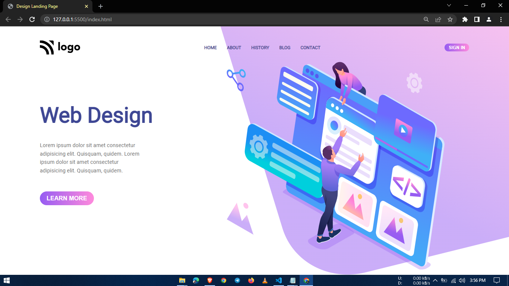

# 8-Design-landing-page

It is part of the Full Stack Javascript Bootcamp being taught at ineuron.ai by Hitesh Choudhary Sir.

## Project 8 [Live Link](https://design-landing-pages.netlify.app/)

- During this project, I gained the following skills:
  - I learned how to create a linear gradient background
  - I learned how to center any svgs, images as background by using background-position & background-repeat.

---

## Time taken to finish this project

- 3 hour to complete it.

#### Screenshot

